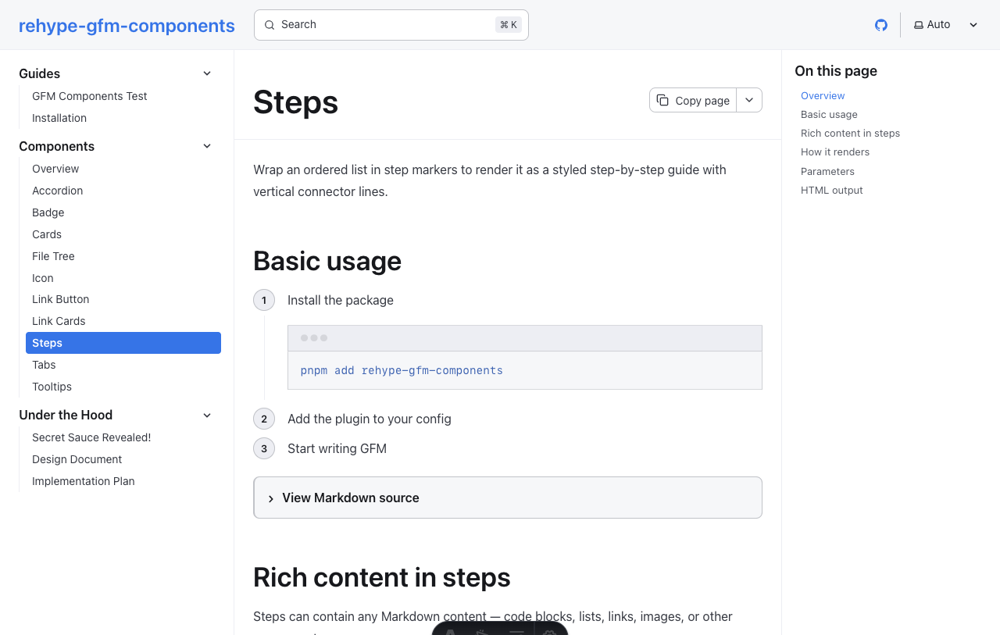
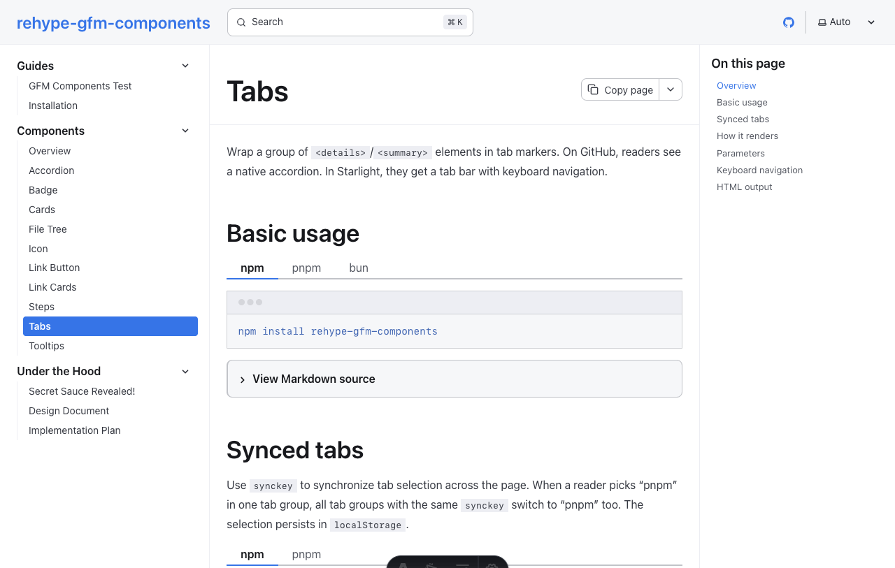
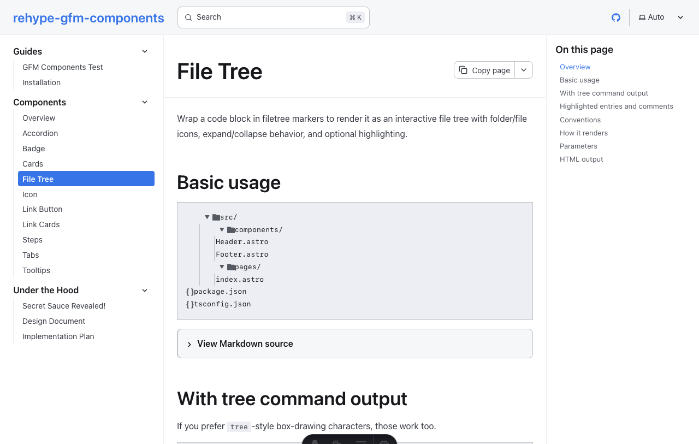
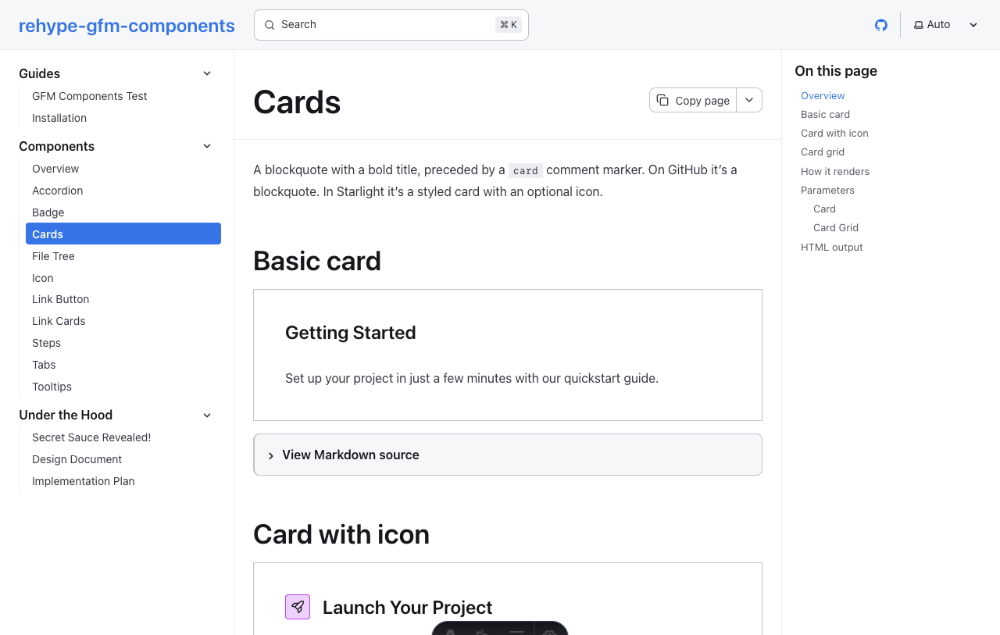
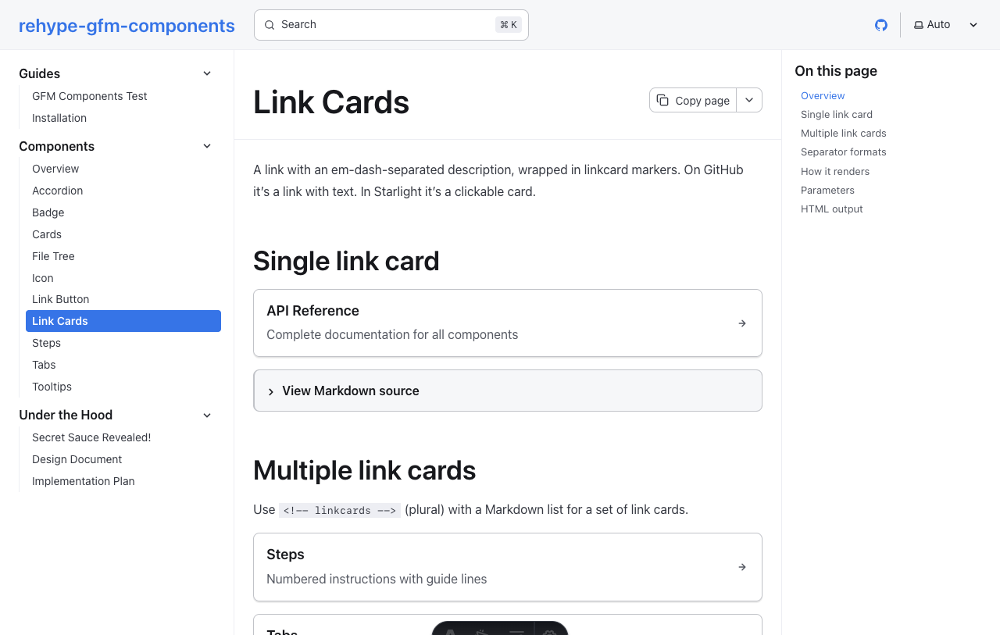
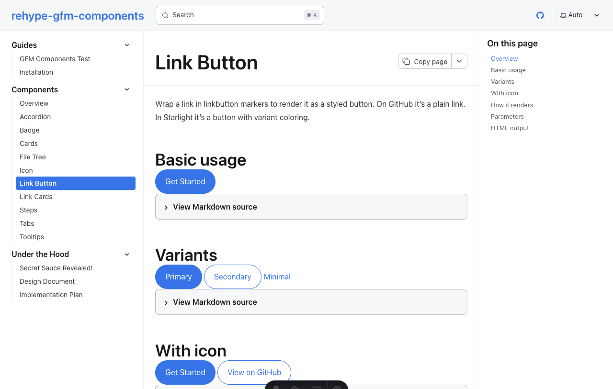
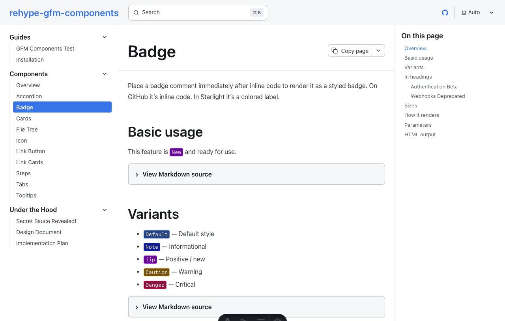
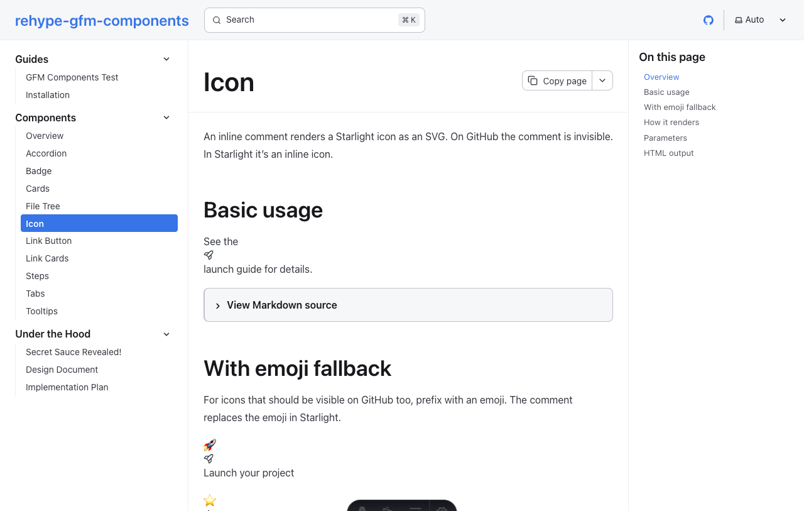
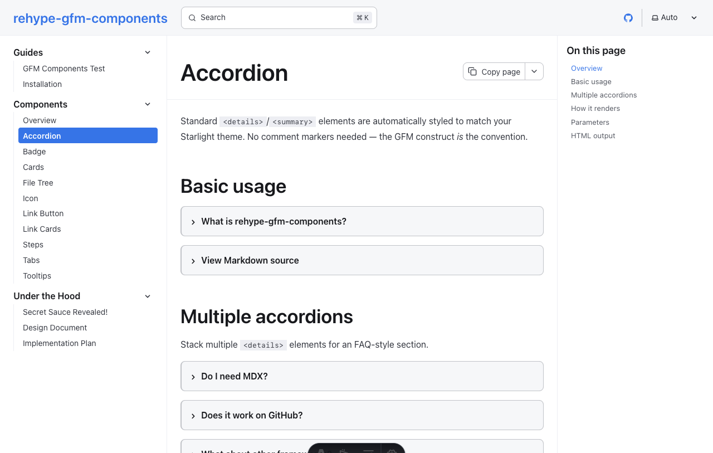
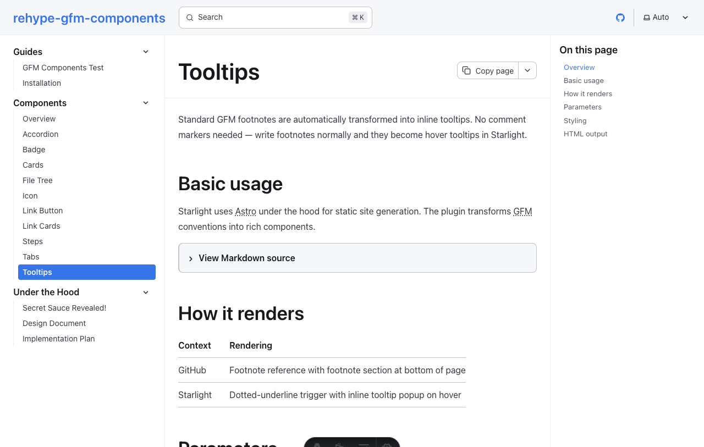

# rehype-gfm-components

> _keep your chocolate out of my peanut butter_

[](https://codecov.io/github/claylo/rehype-gfm-components)

Write GFM. View it on GitHub. Deploy it with Starlight. **The same Markdown file works in both places** — readable on GitHub, rich and interactive in Starlight. No MDX. No imports. No JSX.

HTML comments are invisible on GitHub. This plugin uses them as upgrade markers around standard GFM constructs, and a rehype transform turns the output into Starlight-equivalent components. Your content stays portable.

## Install

```bash
pnpm add rehype-gfm-components
```

## Usage

### As a Starlight plugin

```js
import starlightGfmComponents from "rehype-gfm-components/starlight";

export default defineConfig({
  integrations: [
    starlight({
      plugins: [starlightGfmComponents()],
    }),
  ],
});
```

### As a raw rehype plugin

```js
import rehypeGfmComponents from "rehype-gfm-components";

export default {
  markdown: {
    rehypePlugins: [rehypeGfmComponents],
  },
};
```

## Components

Every example below is **plain GFM Markdown**. The code blocks show exactly what you write — nothing more.

---

### Steps

Wrap an ordered list in step markers. On GitHub it's a numbered list. In Starlight it's a styled step-by-step guide.

```markdown
<!-- steps -->
1. Install the package
   ```bash
   pnpm add rehype-gfm-components
   ```
2. Add the plugin to your config
3. Start writing GFM
<!-- /steps -->
```

<details>
<summary>Rendered in Starlight</summary>



</details>

---

### Tabs

Wrap `<details>`/`<summary>` groups in tab markers. On GitHub readers get a native accordion. In Starlight they get a tab bar with keyboard navigation.

```markdown
<!-- tabs synckey:pkg -->
<details open>
<summary>npm</summary>

npm install rehype-gfm-components

</details>
<details>
<summary>pnpm</summary>

pnpm add rehype-gfm-components

</details>
<!-- /tabs -->
```

`synckey` syncs tab selection across the page and persists in `localStorage`.

<details>
<summary>Rendered in Starlight</summary>



</details>

---

### File Tree

Wrap a code block in filetree markers. Supports both indentation-based and `tree`-style box-drawing formats.

````markdown
<!-- filetree -->
```
src/
  components/
    Header.astro          # highlight
    Footer.astro          # the footer component
  pages/
    index.astro
package.json
```
<!-- /filetree -->
````

Trailing `/` = directory. `# highlight` = highlighted entry. `# text` = annotation.

<details>
<summary>Rendered in Starlight</summary>



</details>

---

### Cards

A blockquote with a bold title, preceded by a `card` comment. Optional `icon` parameter for Starlight icons.

```markdown
<!-- card icon:rocket -->
> **Launch Your Project**
>
> Everything you need to go from zero to production.
```

Wrap multiple cards in `<!-- cardgrid -->` for a responsive 2-column layout.

<details>
<summary>Rendered in Starlight</summary>



</details>

---

### Link Cards

A link with an em-dash-separated description. Single or list form.

```markdown
<!-- linkcards -->
- [API Reference](/reference/api) — Complete API documentation
- [Getting Started](/guides/start) — Set up your first project
- [Configuration](/reference/config) — All configuration options
<!-- /linkcards -->
```

<details>
<summary>Rendered in Starlight</summary>



</details>

---

### Link Button

Wrap a link in button markers with optional variant and icon parameters.

```markdown
<!-- linkbutton variant:primary icon:right-arrow -->
[Get Started](/guides/start)
<!-- /linkbutton -->
```

Variants: `primary`, `secondary`, `minimal`.

<details>
<summary>Rendered in Starlight</summary>



</details>

---

### Badge

Inline code immediately followed by a badge comment. The backtick text becomes the badge label.

```markdown
This feature is `New`<!-- badge variant:tip --> and ready for use.

## Authentication `Beta`<!-- badge variant:caution -->
```

Variants: `default`, `note`, `tip`, `caution`, `danger`. Sizes: `small`, `medium`, `large`.

<details>
<summary>Rendered in Starlight</summary>



</details>

---

### Icon

Inline comment renders a Starlight icon. Invisible on GitHub, inline SVG in Starlight.

```markdown
See the <!-- icon:rocket --> launch guide for details.
```

For icons that should be visible on GitHub too, prefix with an emoji:

```markdown
:rocket:<!-- icon:rocket --> Launch your project
```

<details>
<summary>Rendered in Starlight</summary>



</details>

---

### Accordion

Bare `<details>`/`<summary>` elements are automatically styled. **No comment markers needed.**

```markdown
<details>
<summary>What is rehype-gfm-components?</summary>

A rehype plugin that transforms standard GFM Markdown into rich
documentation components. Write once, render beautifully everywhere.

</details>
```

<details>
<summary>Rendered in Starlight</summary>



</details>

---

### Tooltips

GFM footnotes become inline tooltips on hover. **No comment markers needed.** Enabled by default.

```markdown
Starlight uses Astro[^1] under the hood for static site generation.

[^1]: Astro is a web framework focused on content-driven websites.
```

On GitHub: footnote reference with footnote section at bottom. In Starlight: dotted-underline trigger with inline tooltip popup.

<details>
<summary>Rendered in Starlight</summary>



</details>

---

## Configuration

```js
rehypeGfmComponents({
  // Enable only specific transforms (default: all)
  transforms: ["steps", "tabs", "filetree"],

  // Provide custom icon SVG data (default: auto-detect from Starlight)
  icons: { rocket: '<path d="M1 1"/>' },

  // Disable footnote-to-tooltip transform (default: true)
  tooltips: false,
})
```

## Dependencies

Two runtime dependencies. That's it.

- `unist-util-visit` — tree traversal
- `hast-util-from-html-isomorphic` — HTML-to-HAST parsing

## Code Coverage

[](https://codecov.io/github/claylo/rehype-gfm-components)

## License

MIT
